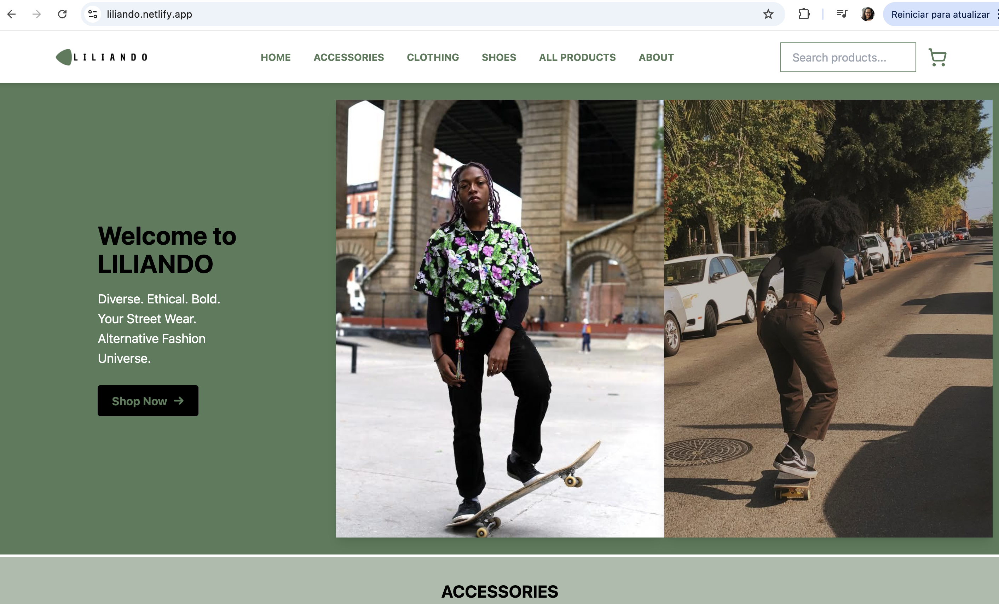

# LILIANDO E-Commerce

## Overview
LILIANDO is a fully responsive and dynamic e-commerce web application built as part of the Full-Stack Bootcamp at ReDI School (Spring 2025). Developed by Lilian Rodrigues and showcases streetwear fashion & culture. The project is a modern React/Vite application featuring dynamic product rendering, category filters, localStorage-based cart state, and a smooth user experience using Tailwind CSS.

This project is the continuation of Lilian Rodrigues’ first-ever HTML/CSS website, built in June 2024 at ReDI School. It now evolves into a modern, React-powered experience.
[https://codepen.io/Lilian-Rodrigues/pen/XWQGJbB](https://codepen.io/Lilian-Rodrigues/pen/XWQGJbB)

components/
- Navbar.jsx
- Footer.jsx
- ProductCard.jsx
- ProductModal.jsx
  
pages/
- Home.jsx
- Products.jsx
- Cart.jsx
- Checkout.jsx
- ProductPage.jsx


---

### Screenshot


---

### Features

### Users can:
- View products organized by category: Accessories, Clothing, and Shoes
- Scroll product sections horizontally (Zalando-style layout)
- Search for products by name or brand
- Filter products by brand or category
- View individual product pages with image galleries
- Add items to cart, update quantities, and remove items
- Proceed to a styled checkout form (demo only)
- See a modal confirmation after 'placing' an order
- Experience persistent cart data via localStorage
- Scroll-to-top button appears on mobile for smoother navigation


---

## Live Site  
[https://liliando.netlify.app](https://liliando.netlify.app) 

---

## Solution URL
GitHub repository:  
[https://github.com/Lilian-CR/liliando-ecommerce](https://github.com/Lilian-CR/liliando_ecommerce) 

---

## Tools & Technologies

- **React** — Component-based UI framework
- **Vite** — Lightning-fast build tool
- **Tailwind CSS** — Utility-first CSS framework
- **React Router DOM** — Page navigation and routing
- **Lucide React** — Icon library
- **LocalStorage** — Cart state persistence
- **Netlify** — Deployment

---

## Resources & Inspiration

- [Tailwind CSS Docs](https://tailwindcss.com)
- [React Docs](https://reactjs.org)
- [Lucide Icons](https://lucide.dev)
- [CodeCademy](https://www.codecademy.com/)
- Inspiration: Zalando UX, Vans, Dickies, Hell Bunny, Canva, and bold streetwear aesthetics

---

---

## Installation

To run locally:
1. Clone the repository:
```bash
git clone https://github.com/Lilian-CR/liliando_ecommerce.git
```
2. Navigate into the project folder:
```bash
cd liliando_ecommerce
```
3. Install dependencies:
```bash
npm install
```
4. Run the dev server:
```bash
npm run dev
```

---

## Deployment
The project is deployed using **Netlify** for its ease of integration with React and GitHub. 

---

## Acknowledgements
- Special thanks to teachers, classmates and the whole team at ReDI School Berlin
- Inspired by brands that align with alternative values and ethical fashion
